<h1 align="center">Всем привет! 👋 Меня зовут Кирилл Цыганов</h1>
<h3 align="center">Backend Разработчик из России</h3>

  

---

### 👨‍💻 Обо мне
Я учусь в РТУ МИРЭА на фуллстек разработчика. Специализируюсь на создании бекэнд части полнофункциональных веб-приложений под ключ — от идеи до запуска на сервере.

---

### 🛠 Технологии и инструменты

**Бэкенд:**

**Базы данных и DevOps:**

---

### 🚀 Мои проекты

**1 Friday - Голосовой помощник**  
*Мультиплатформенный голосовой ассистент с поддержкой 3 типов устройств*
- 🌐 **Веб-версия**: [Friday Assistant](https://friday-assistant.ru/) | 📂 [GitHub](https://github.com/Avelgar/friday-server)
- 📱 **Android**: 📂 [GitHub](https://github.com/Avelgar/FridayAndroid)
- 💻 **Windows**: 📂 [GitHub](https://github.com/Avelgar/FRIDAY)
- 🍓 **Raspberry PI** 📂 [GitHub](https://github.com/Avelgar/FridayRaspberry)

**2 Юзербот Олег**    
*Телеграмм юзербот для общения с Gemini*
- 🌐 **Написать Олегу**: [Телеграм](https://t.me/oleg_userbot)
- 📂 [GitHub](https://github.com/Avelgar/OlegUserBot)

**3 CoinTracker**  
*Сайт для прогнозирования курсов криптовалют*
- 🌐 **Веб-версия**: [CoinTracker](http://blue.fnode.me:25539/)
- 📂 [GitHub](https://github.com/Avelgar/CoinTracker)

**4 MWS Router**
*Умная автоподмена моедли ИИ в зависимости от запроса пользователя и выбранной модели*
Напишите в дипсик "Нарисуй кота" и он нарисует
- 🌐 **Веб-версия**: [MWS Router](https://mws-router.ru/)

**5 Health Sync**
*Медицинское приложение на Flutter для получения советов по питанию, сну и физ. активности*
Есть интеграция Gemini для анализа продуктов на фото и получения советов.
- 🌐 **Веб-версия**: [Health Sync](https://health-sync.online/)

**6 Шахматы против Gemini**  
*Веб интерфейс для игры в шахматы против Gemini и анализа партий*  
- 🌐 **Веб-версия**: [Chess](http://purple.fnode.me:25514/)

**7 Telegram Monitoring Bot System**  
*UserBot - отслеживает сообщения в Telegram на основе заданных критериев*  
*ConfigBot - принимает уведомления и предоставляет интерфейс для настройки*
- 📂 [GitHub](https://github.com/Avelgar/Telegram-Monitoring-Bot-System)

**8 Ozon Smart Filter**  
*Умное расширение для Google Chrome, которое очищает выдачу Ozon.ru от мусора*  
- 📂 [GitHub](https://github.com/Avelgar/Ozon-Filter)

---

  
  

---

### 📈 Мой путь (Roadmap)

```mermaid
graph TD
    classDef default fill:#2a2a2a,stroke:#ccc,stroke-width:1px,color:#fff,rx:10,ry:10;
    classDef active fill:#a2d9ff,stroke:#333,stroke-width:2px,color:#000,rx:10,ry:10;
    classDef cluster fill:#1a1a1a,stroke:#444,stroke-width:2px,color:#fff,rx:15,ry:15;

    subgraph Year2024 ["📅 2024: Основы и C++"]
        direction TB
        p1["Python (Вышка) Январь"]
        p2("C++ Решатель (МИРЭА) март - май")
        p3("C++ ООП и библиотеки июнь-август")
        p4("JS + NodeJs Reminder сентябрь-декабрь")
        
        p1 --> p2 --> p3 --> p4
    end

    subgraph Year2025 ["📅 2025: Веб, Мобайл и 'Пятница'"]
        direction TB
        p5("Go + Vue Cointracker январь-май")
        p6("Python + C# Пятница Win март-май"):::active
        p7("Python + Java Пятница Android март-май"):::active
        p8("Python + Nginx Деплой на VPS июль-октябрь")
        p9("Python ТГ бот (STT) сентябрь")
        p10("Python Юзербот мониторинг сентябрь")
        p11("Python SIP бот октябрь-ноябрь")
        p12("VPN OpenVPN ноябрь")
        p13("Python + JS Курсовая ноябрь")
        p14("Python + JS Шахматы vs Gemma ноябрь")
        p15("JS Ozon Filter ноябрь")
        p16("Python + JS Хакатон МАИ ноябрь")
        p17("Python + JS Магазин товаров декабрь")
        p18("Python + Dart Диплом (начало) декабрь")

        p5 --> p6 --> p7 --> p8 --> p9 --> p10 --> p11 --> p12 --> p13 --> p14 --> p15 --> p16 --> p17 --> p18
    end

    subgraph Year2026 ["📅 2026: Дипломы и Системы"]
        direction TB
        p19("Python + Dart Диплом Flutter январь-февраль")
        p20["Python + Raspberry Pi робот январь - март"]:::active
        p21("Python + Kotlin Курсовая февраль")
        p22("VPN vless/reality + Яндекс март"):::active
        p23["Golang ТГ бот Wildberries март"]:::active

        p19 --> p20 --> p21 --> p22 --> p23
    end

    %% Соединение годов в одну линию
    p4 --> p5
    p18 --> p19

    class Year2024,Year2025,Year2026 cluster;
```

---

  

