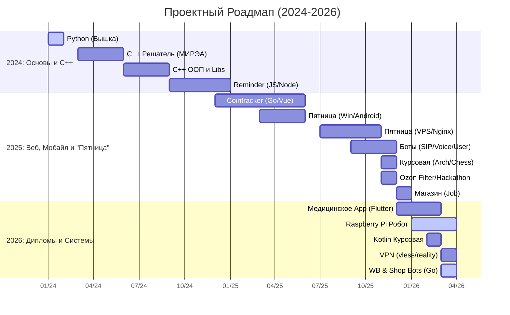

<h1 align="center">Всем привет! 👋 Меня зовут Кирилл Цыганов</h1>
<h3 align="center">Backend Разработчик из России</h3>

  

---

### 👨‍💻 Обо мне
Я учусь в РТУ МИРЭА на фуллстек разработчика. Специализируюсь на создании бекэнд части полнофункциональных веб-приложений под ключ командой — от идеи до запуска на сервере.

---

### 🛠 Технологии и инструменты

**Бэкенд:**

**Базы данных и DevOps:**

---

### 📈 Мой путь (Roadmap)

---

### 🚀 Мои проекты

**1 Friday - Голосовой помощник**  
*Мультиплатформенный голосовой ассистент с поддержкой 3 типов устройств*
- 🌐 **Веб-версия**: [Friday Assistant](https://friday-assistant.ru/) | 📂 [GitHub](https://github.com/Avelgar/friday-server)
- 📱 **Android**: 📂 [GitHub](https://github.com/Avelgar/FridayAndroid)
- 💻 **Windows**: 📂 [GitHub](https://github.com/Avelgar/FRIDAY)
- 🍓 **Raspberry PI** 📂 [GitHub](https://github.com/Avelgar/FridayRaspberry)

**2 Юзербот Олег**    
*Телеграмм юзербот для общения с Gemini*
- 📂 [GitHub](https://github.com/Avelgar/OlegUserBot)

**3 CoinTracker**  
*Сайт для прогнозирования курсов криптовалют*
- 📂 [GitHub](https://github.com/Avelgar/CoinTracker)

**4 Speech Recognition Bot**  
*Телеграмм бот для распознавания речи из голосовых сообщений и видео*
- 🤖 [@Cool_Speech_To_Text_Bot](https://t.me/Cool_Speech_To_Text_Bot)
- 📂 [GitHub](https://github.com/Avelgar/Speech-recognition-bot)

**5 Telegram Monitoring Bot System**  
*UserBot - отслеживает сообщения в Telegram на основе заданных критериев*  
*ConfigBot - принимает уведомления и предоставляет интерфейс для настройки*
- 📂 [GitHub](https://github.com/Avelgar/Telegram-Monitoring-Bot-System)

**6 Ozon Smart Filter**  
*Умное расширение для Google Chrome, которое очищает выдачу Ozon.ru от мусора*  
- 📂 [GitHub](https://github.com/Avelgar/Ozon-Filter)

---

### 📊 Статистика GitHub

  
  

---
### 📞 Обсудим ваш проект?

Я готов воплотить ваши идеи в жизнь. Я идеально подхожу для создания MVP, написания курсовых работ, API, ботов и других веб-приложений.

**Ключевые условия и цены:**
*   **Бесплатная** консультация
*   Красивый и современный дизайн
*   Современный стек технологий
*   Веб-проекты от **10000** рублей

  
  

---

  

